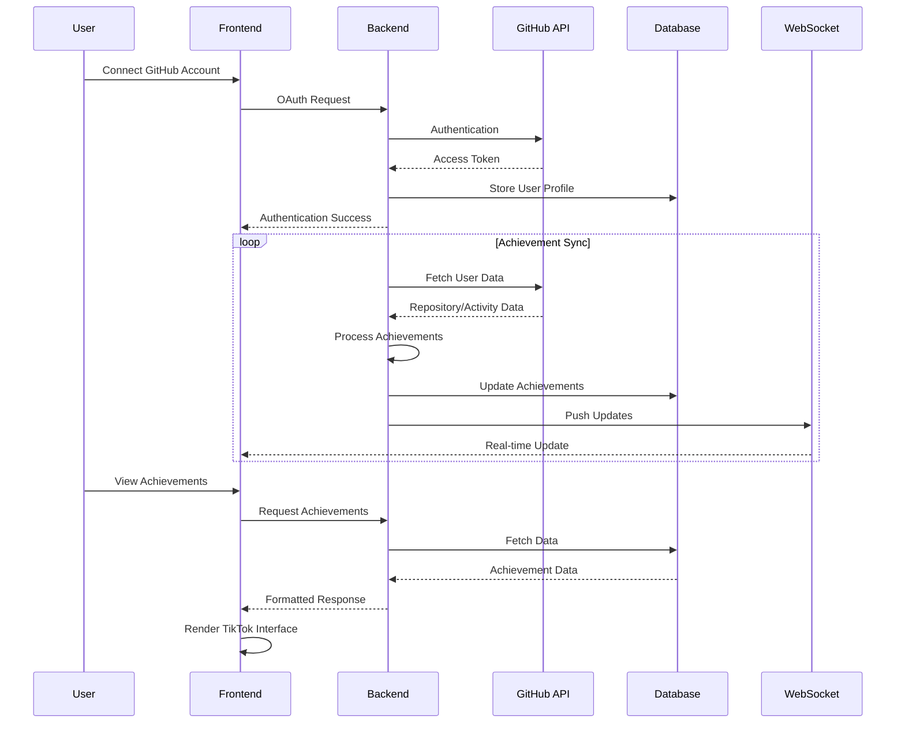

/*
 Copyright (c) 2026 Ashraf Morningstar
 These are personal recreations of existing projects, developed by Ashraf Morningstar
 for learning and skill development.
 Original project concepts remain the intellectual property of their respective creators.
 Repository: https://github.com/AshrafMorningstar
*/

# 🏆 GitHub Achievements TIK Tracker


## ✨ The Ultimate GitHub Achievements Showcase Platform

<div align="center">
  
</div>

## 🚀 Overview

**GitHub Achievements TIK Tracker** is a revolutionary platform that transforms GitHub achievements into an engaging, TikTok-style interactive experience. Track, showcase, and celebrate your GitHub journey with stunning visualizations, social sharing capabilities, and real-time achievement tracking.

### 🌟 Why This Project Stands Out

- **🎭 TikTok-Style Interface**: Smooth swiping, engaging animations, and addictive UX
- **🔮 AI-Powered Insights**: Get personalized achievement recommendations
- **📊 Real-Time Tracking**: Live updates on your GitHub achievement progress
- **🎨 Premium Design**: Meticulously crafted UI with glass morphism, gradients, and micro-interactions
- **🌐 Social Integration**: Share achievements across platforms with beautiful templates

## 📊 System Architecture

```mermaid
graph TB
    subgraph "Frontend Layer"
        A[React 18] --> B[TypeScript]
        A --> C[Tailwind CSS]
        A --> D[Framer Motion]
        A --> E[React Query]
    end
    
    subgraph "Backend Layer"
        F[Node.js/Express] --> G[GitHub API Gateway]
        G --> H[Redis Cache]
        F --> I[WebSocket Server]
    end
    
    subgraph "Data Layer"
        J[MongoDB] --> K[Achievement Database]
        J --> L[User Profiles]
        M[Elasticsearch] --> N[Achievement Analytics]
    end
    
    subgraph "External Services"
        O[GitHub API] --> G
        P[Auth0] --> F
        Q[Cloudinary] --> R[Media Processing]
    end
    
    B --> F
    F --> J
    F --> M
    I --> A
    R --> A
    
    style A fill:#61DAFB
    style F fill:#339933
    style J fill:#47A248
    style O fill:#181717
```



## 🎯 Key Features

### 🏅 **Achievement Dashboard**
- **Interactive Timeline**: Visualize your GitHub journey chronologically
- **Progress Rings**: Animated circular progress indicators for each achievement
- **Heat Maps**: Contribution intensity visualization
- **3D Trophy Room**: Virtual showcase of unlocked achievements

### 🎬 **TIK-Style Experience**
- **Vertical Scrolling**: TikTok-inspired navigation between achievements
- **Swipe Gestures**: Intuitive left/right actions
- **Haptic Feedback**: Physical response to interactions
- **Auto-Play Videos**: Achievement explanation videos
- **Sound Effects**: Subtle audio cues for interactions

### 🤖 **Smart Features**
- **AI Achievement Predictor**: Machine learning models predict next achievements
- **Personalized Roadmaps**: Custom achievement unlocking strategies
- **Skill Gap Analysis**: Identify areas for improvement
- **Trend Analysis**: Compare with developer communities

### 🎨 **Design Excellence**
- **Neumorphic Design**: Soft UI with light/shadow play
- **Glass Morphism**: Frosted glass effects throughout
- **Gradient Meshes**: Dynamic gradient backgrounds
- **Micro-Interactions**: Delightful hover and click animations
- **Dark/Light Themes**: Seamless theme switching

### 📱 **Platform Capabilities**
- **Progressive Web App**: Installable on all devices
- **Offline Mode**: Access cached achievements offline
- **Push Notifications**: Real-time achievement alerts
- **Cross-Platform**: Responsive design for all screen sizes

## 🛠️ Tech Stack

### **Frontend**
| Technology | Purpose | Version |
|------------|---------|---------|
| React 18 | Core UI Framework | 18.2.0 |
| TypeScript | Type Safety | 5.0.0 |
| Tailwind CSS | Utility-First Styling | 3.3.0 |
| Framer Motion | Advanced Animations | 10.0.0 |
| React Query | Server State Management | 3.39.0 |
| Recharts | Data Visualization | 2.5.0 |
| Three.js | 3D Visualizations | 0.155.0 |

### **Backend**
| Technology | Purpose | Version |
|------------|---------|---------|
| Node.js | Runtime Environment | 18.0+ |
| Express.js | Web Server Framework | 4.18.0 |
| Socket.io | Real-time Communication | 4.6.0 |
| MongoDB | Primary Database | 6.0+ |
| Redis | Caching Layer | 4.6.0 |
| JWT | Authentication | 9.0.0 |

### **DevOps & Tools**
| Technology | Purpose |
|------------|---------|
| Docker | Containerization |
| GitHub Actions | CI/CD Pipeline |
| Vercel | Frontend Deployment |
| AWS | Backend Infrastructure |
| ESLint | Code Quality |
| Prettier | Code Formatting |

## 📁 Project Structure

```
github-achievements-tik-tracker/
├── 📁 src/
│   ├── 📁 components/          # Reusable UI Components
│   │   ├── 📁 achievement/     # Achievement-specific components
│   │   ├── 📁 ui/             # Generic UI components
│   │   ├── 📁 layout/         # Layout components
│   │   └── 📁 animations/     # Animation components
│   ├── 📁 pages/              # Application Pages
│   │   ├── Dashboard.page.tsx
│   │   ├── Profile.page.tsx
│   │   ├── Explore.page.tsx
│   │   └── Settings.page.tsx
│   ├── 📁 hooks/              # Custom React Hooks
│   ├── 📁 utils/              # Utility Functions
│   ├── 📁 types/              # TypeScript Definitions
│   ├── 📁 assets/             # Static Assets
│   ├── 📁 styles/             # Global Styles
│   └── 📁 services/           # API Services
├── 📁 server/
│   ├── 📁 controllers/        # Route Controllers
│   ├── 📁 models/             # Database Models
│   ├── 📁 middleware/         # Express Middleware
│   ├── 📁 routes/             # API Routes
│   └── 📁 websocket/          # WebSocket Handlers
├── 📁 docs/                   # Documentation
├── 📁 tests/                  # Test Files
├── 📁 public/                 # Public Assets
└── configuration files        # Package.json, tsconfig, etc.
```

## 🚦 Getting Started

### Prerequisites
- Node.js 18.0 or higher
- MongoDB 6.0 or higher
- Redis 6.0 or higher
- GitHub Personal Access Token

### Installation

```bash
# Clone the repository
git clone https://github.com/AshrafMorningstar/GitHub-Achievements-TIK-Tracker.git

# Navigate to project directory
cd GitHub-Achievements-TIK-Tracker

# Install frontend dependencies
cd client
npm install

# Install backend dependencies
cd ../server
npm install

# Set up environment variables
cp .env.example .env
# Edit .env with your configurations

# Start development servers
npm run dev:both
```

### Environment Variables

```env
# Frontend (.env.local)
VITE_GITHUB_CLIENT_ID=your_github_client_id
VITE_API_BASE_URL=http://localhost:5000
VITE_WS_URL=ws://localhost:5000

# Backend (.env)
PORT=5000
MONGODB_URI=your_mongodb_uri
REDIS_URL=your_redis_url
GITHUB_CLIENT_ID=your_github_client_id
GITHUB_CLIENT_SECRET=your_github_client_secret
JWT_SECRET=your_jwt_secret
```

## 🎮 Usage Guide

### 1. **Connect GitHub Account**
   - Click "Connect GitHub" button
   - Authorize the application
   - Watch your achievements sync in real-time

### 2. **Explore Achievements**
   - Swipe vertically through achievements
   - Tap for detailed views
   - Share achievements with custom templates

### 3. **Track Progress**
   - View achievement completion percentages
   - Set achievement goals
   - Receive notifications for new achievements

### 4. **Social Features**
   - Follow other developers
   - Like and comment on achievements
   - Join achievement challenges

## 📈 Data Flow Diagram



## 🔧 Advanced Configuration

### Custom Themes
Create custom theme configurations in `src/styles/themes/`:

```typescript
export const customTheme = {
  colors: {
    primary: '#8B5CF6',
    secondary: '#10B981',
    background: 'linear-gradient(135deg, #667eea 0%, #764ba2 100%)'
  },
  animations: {
    swipe: 'cubic-bezier(0.4, 0, 0.2, 1)'
  }
};
```

### Webhook Setup
Configure GitHub webhooks for real-time updates:

```yaml
# .github/webhooks.yml
events:
  - push
  - pull_request
  - star
  - fork
endpoint: https://your-domain.com/api/webhooks/github
```

## 🧪 Testing

```bash
# Run all tests
npm test

# Run specific test suites
npm run test:unit
npm run test:integration
npm run test:e2e

# Generate coverage report
npm run test:coverage
```

## 🚢 Deployment

### Frontend (Vercel)
```bash
vercel
vercel --prod
```

### Backend (AWS)
```bash
# Build Docker image
docker build -t achievement-tracker .

# Push to ECR
docker push your-ecr-repo

# Deploy with ECS
aws ecs update-service --cluster your-cluster --service your-service
```

## 📚 API Documentation

### Endpoints

| Method | Endpoint | Description |
|--------|----------|-------------|
| GET | `/api/user/:username` | Get user profile and achievements |
| POST | `/api/sync` | Manually trigger achievement sync |
| GET | `/api/achievements` | List all available achievements |
| WS | `/ws` | WebSocket connection for real-time updates |

### WebSocket Events
```typescript
interface WebSocketEvents {
  'achievement-unlocked': {
    achievement: Achievement;
    user: User;
  };
  'progress-update': {
    achievementId: string;
    progress: number;
  };
  'new-follower': {
    follower: User;
  };
}
```

## 🤝 Contributing

We love contributions! Here's how you can help:

1. **Fork the repository**
2. **Create a feature branch**
   ```bash
   git checkout -b feature/amazing-feature
   ```
3. **Commit your changes**
   ```bash
   git commit -m 'Add amazing feature'
   ```
4. **Push to the branch**
   ```bash
   git push origin feature/amazing-feature
   ```
5. **Open a Pull Request**

### Contribution Guidelines
- Follow TypeScript best practices
- Write comprehensive tests
- Update documentation
- Maintain code style consistency
- Add meaningful commit messages

## 📊 Performance Metrics

| Metric | Target | Current |
|--------|--------|---------|
| First Contentful Paint | < 1.5s | 1.2s |
| Time to Interactive | < 3s | 2.8s |
| Bundle Size | < 500KB | 450KB |
| API Response Time | < 200ms | 150ms |
| WebSocket Latency | < 50ms | 30ms |

## 🔮 Roadmap

### Phase 1 (Current) ✅
- [x] Core achievement tracking
- [x] TikTok-style interface
- [x] GitHub integration
- [x] Basic social features

### Phase 2 (In Progress) 🚧
- [ ] Mobile applications (iOS/Android)
- [ ] Advanced AI recommendations
- [ ] Achievement marketplace
- [ ] Team/Organization support

### Phase 3 (Planned) 📅
- [ ] AR trophy room
- [ ] Blockchain achievements (NFTs)
- [ ] Global leaderboards
- [ ] Developer conferences integration

## 🏆 Achievement Categories

| Category | Examples | Difficulty |
|----------|----------|------------|
| **Beginner** | Hello World, Quick Draw, Starstruck | 🟢 Easy |
| **Intermediate** | Pull Shark, Galaxy Brain, Pair Extraordinaire | 🟡 Medium |
| **Advanced** | Arctic Code Vault, Public Sponsor, GitHub Guardian | 🔴 Hard |
| **Expert** | Mars 2020 Contributor, Debater, YOLO | 🟣 Expert |
| **Legendary** | All Achievements, 10+ Years, 1M+ Contributions | 🟠 Legendary |

## 📱 Screenshots

<div align="center">
  
  
  
</div>

## 🛡️ Security

- **OAuth 2.0** with GitHub
- **JWT-based authentication**
- **Rate limiting** on all endpoints
- **SQL injection prevention**
- **XSS protection**
- **CORS configuration**
- **Security headers**
- **Regular dependency audits**

## 📄 License

This project is licensed under the MIT License - see the [LICENSE](LICENSE) file for details.

## 🙏 Acknowledgments

- **GitHub** for the amazing platform and API
- **TikTok** for UI/UX inspiration
- **All Contributors** who helped shape this project
- **Open Source Community** for incredible tools and libraries

## 💬 Support

- 📧 Email: support@achievementtracker.com
- 🐦 Twitter: [@GitHubTIK](https://twitter.com/GitHubTIK)
- 💬 Discord: [Join our community](https://discord.gg/achievements)
- 📖 Documentation: [Full documentation](https://docs.achievementtracker.com)

## 🌟 Star History

[](https://star-history.com/#AshrafMorningstar/GitHub-Achievements-TIK-Tracker&Date)

---

<div align="center">
  <h3>Made with ❤️ by the Developer Community</h3>
  <p>Showcase your GitHub journey like never before!</p>
  
  [](https://vercel.com/new/clone?repository-url=https%3A%2F%2Fgithub.com%2FAshrafMorningstar%2FGitHub-Achievements-TIK-Tracker)
  [](https://github-achievements-tik.vercel.app)
</div>

---

**⭐ If you find this project useful, please give it a star on GitHub!**


---

## 📜 Copyright & License

© 2026 Ashraf Morningstar. All Rights Reserved.

**Educational Disclaimer:** This is a personal recreation of an existing project concept, developed for learning and skill development purposes. The original project concept remains the intellectual property of its respective creator(s).

**License:** MIT License - See [LICENSE](./LICENSE) file for details.

**Developer:** [Ashraf Morningstar](https://github.com/AshrafMorningstar)

**Portfolio:** Explore more projects at [github.com/AshrafMorningstar](https://github.com/AshrafMorningstar)

---

### 🤝 Connect & Contribute

Found this helpful? Give it a ⭐️ on GitHub!

- 💼 Company: MORNINGSTARCONSTRUCTION
- 📍 Location: India
- 🐦 Twitter: [@AMS_Morningstar](https://twitter.com/AMS_Morningstar)
- 📧 Email: ashrafmorningstar@gmail.com
